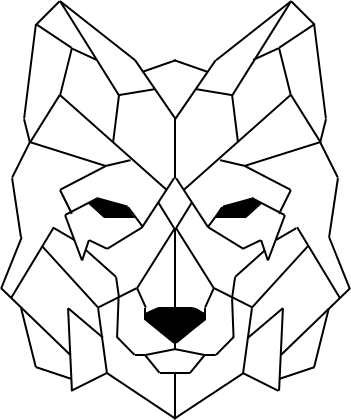

# Hi, I'm Olga Mirończuk

**Aspiring Data Analyst** passionate about turning data into insights.  
Skilled in **Python, SQL, Excel, Power BI**, and currently learning **Tableau**.  
I build my skills through real projects - from data exploration to clear storytelling.  

## 📂 Featured Project
<table style="border-collapse: collapse;">
  <tr>
    <td>
      
    </td>
    <td style="vertical-align: middle; padding-left: 16px;">
      ☕ <a href="https://github.com/Waderlla/Project_Sip_of_Data__Coffee_Consumption_Dashboard">
        <strong>Project: Sip of Data: Coffee Consumption Dashboard</strong>
      </a> 
      Analytical project based on survey data on coffee consumption. The repository includes processed datasets, analytical scripts, and an interactive Power BI dashboard. 
    </td>
  </tr>
  <tr>
    <td>
      
    </td>
    <td style="vertical-align: middle; padding-left: 16px;">
      🦈 <a href="https://github.com/Waderlla/Volunteer_Project_Shark_Bite_Incidents_2000_2024">
        <strong>Volunteer Project: Shark Bite Incidents • 2000–2024</strong>
      </a> 
      Volunteer project conducted for the Global Shark Attack File (Sea Save Foundation). The repository contains data, code, and analytical reports on shark-related incidents from 2000 to 2024.
    </td>
  </tr>
  <tr>
  <td>
    
  </td>
  <td style="vertical-align: middle; padding-left: 16px;">
    📆 <a href="https://github.com/Waderlla/KalendarzAdwnetowy_2025_byOlga_Mironczuk_x_KajoData">
      <strong>Advent Calendar 2025 — Olga Mironczuk x KajoData</strong>
    </a> 
    Partner of the promotion: KajoData • Project repository for the Advent Calendar 2025. It includes the downloadable program file and a user guide in the README.
  </td>
</tr>
</table>

More projects coming soon! See all my work here: [GitHub Repositories](https://github.com/Waderlla?tab=repositories)  

---
## Tools & Skills
- **Python**: Pandas, NumPy, Matplotlib, Seaborn - data cleaning, transformation, visualization, documenting workflows in Jupyter  
- **SQL**: SELECT, JOIN, GROUP BY, WHERE, CTEs, subqueries, window functions  
- **Excel**: advanced formulas, Power Query, PivotTables, dashboards, data preparation  
- **Power BI & Tableau**: interactive dashboards, DAX, data models, usability-focused visuals  

---

## About Me
I learn best by doing - testing, iterating, and building from scratch. My journey into data started with Python, but I quickly realized that the foundations matter most: **clean data, clear visuals, and sharp insights**. That’s why my focus is on clarity, logic, and solutions that make sense.  

---

## Beyond Data
Outside of analytics, I’m a mom of energetic twins - my best teachers of adaptability, time management, and problem-solving under pressure. These everyday skills translate directly into my data work: flexibility, creativity, and staying focused despite challenges.  
<!--
**Waderlla/Waderlla** is a ✨ _special_ ✨ repository because its `README.md` (this file) appears on your GitHub profile.

Here are some ideas to get you started:

- 🔭 I’m currently working on ...
- 🌱 I’m currently learning ...
- 👯 I’m looking to collaborate on ...
- 🤔 I’m looking for help with ...
- 💬 Ask me about ...
- 📫 How to reach me: ...
- 😄 Pronouns: ...
- ⚡ Fun fact: ...
-->
